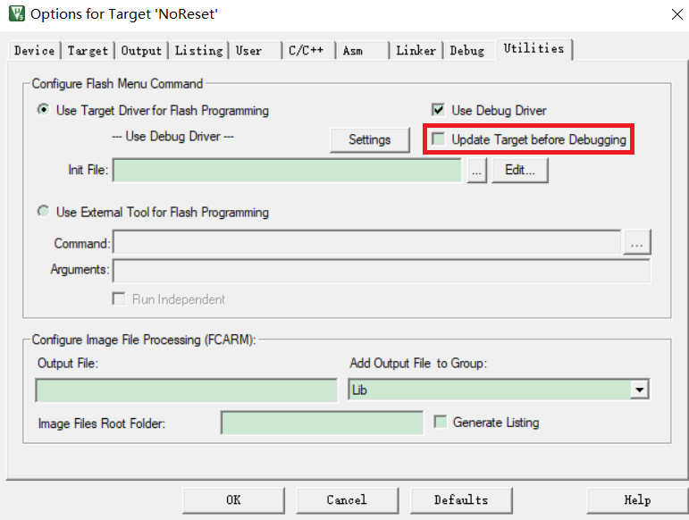

# KEIL仿真调试

最好观看官方的使用手册

[手册](https://www.keil.com/support/man/docs/uv4/uv4_overview.htm)

## 基础按钮


## 变量的观察方式

### watch窗口

查看可变数据

可以将变量添加到窗口，实时观察变化

**注意 ： 如果添加的太多，会导致卡顿，此时建议使用memory窗口进行观察**

<cannot evaluate>，这是啥意思？这个是说明 KEIL 无法找到这个变量。就我所知，有两种情况会出现这种现象：

1)、这个变量不存在：有可能你之前声明过这个变量，后来发现没用到，删除了。

2)、使用 static 声明的变量。

第二种情况，可以运行到使用该变量的地方观察

可以切换进制显示

#### 通过watch窗口查看外设寄存器数据


```c
/** 
  * @brief General Purpose I/O
  */

/*
*	GPIO寄存器结构体
*	这是对照技术手册的地址进行对照的
*/
typedef struct
{
  __IO uint32_t CRL;
  __IO uint32_t CRH;
  __IO uint32_t IDR;
  __IO uint32_t ODR;
  __IO uint32_t BSRR;
  __IO uint32_t BRR;
  __IO uint32_t LCKR;
} GPIO_TypeDef;


#define PERIPH_BASE           ((uint32_t)0x40000000) /*!< Peripheral base address in the alias region */

#define APB2PERIPH_BASE       (PERIPH_BASE + 0x10000)

#define GPIOA_BASE            (APB2PERIPH_BASE + 0x0800)
#define GPIOB_BASE            (APB2PERIPH_BASE + 0x0C00)
#define GPIOC_BASE            (APB2PERIPH_BASE + 0x1000)


#define GPIOA               ((GPIO_TypeDef *) GPIOA_BASE)
#define GPIOB               ((GPIO_TypeDef *) GPIOB_BASE)
#define GPIOC               ((GPIO_TypeDef *) GPIOC_BASE)


```

KEIL 就会从这个地址里读出数据并按照你的指针结构体显示出来

watch窗口有个问题，刷新缓慢

### memory窗口

查看flash数据

按照地址查看，可以选择不同格式数据查看，可以自由修改

Memory 在数据显示上比 Watch 窗口更强大，它可以对单片机上的所有数据进行查看，缺点就是你不知道谁是谁了（没有变量名显示，只能靠地址分辨了）。

注意查看时要添加&


#### 通过memory窗口观察外设寄存器数据

已知外设地址，直接在memory窗口观察即可

可以选择不同宽度显示，方便辨认


### callstack窗口

临时变量可以通过callstack窗口进行查看，这个窗口也可以显示出来函数的调用关系

把断点设置在函数内部，程序停止到函数内部时，可以通过这个窗口查看

最新调用的函数在最下面（所谓的压栈），从下往上看就是

如果你使用操作系统，比如 uCOS，你是没办法在任务函数中观察到这个的，因为任务函数的调用由操作系统负责


### Register窗口

在单片机中，有一种及其特殊的变量，就是**寄存器变量**

这些寄存器没有所谓的地址，所以你没有办法通过取址符 & 获取一个申明为 register 的变量（寄存器的存取速度超快，所以如果一个变量的使用得非常频繁，那么申明为 register 是一个明智之举，但这只是建议编译器去这么做而已，编译器听不听就不知道了，所以即使你声明一个变量为 register，它还可能是内存变量）

可以通过Register窗口观察

## 逻辑分析仪

**很多时候我们并不满足于查看变量的值，可能还想看这个变量的历史变化，同时以波形的方式显示出来，这就需要了解 KEIL 另一个有趣的东西：逻辑分析仪**


从上面的按钮可以打开逻辑分析仪，通过setup按钮可以添加变量

只有在程序中定义过的，才可以被添加到逻辑分析仪内


可以添加变量，也可以添加对应的IO口

例如PA8

 1.（PORTA & 0x00000100）>> 8

2.   新建添加后，直接在编辑框中输入PORTA，然后底下显示类型中选位类型，下来在右移设置框里面填8，代表PA口的值右移8位，也就是要观察PA8的值
3. 在新建的时候直接输入 PORTA.8 代表PA8口，输入完之后按回车键，软件会自动变成位定义

显示类型用bit

## ini 文件的基础使用

如何记录调试过程中的历史数据？？
在keil里面：

[以下转自天使也有爱博文](https://blog.csdn.net/u014783785/article/details/92581102)

ITM 调试，硬件不支持就不能使用
ini文件可不用硬件支持也可以使用

 ini文件相当于一个额外的.c 文件，可以实现如单片机程序的绝大多数事情，比如读取 IO，读取寄存器，读取内存，操作寄存器，写入内存等等，更多详细的内容可参看官方的在线帮助文档。

[我认为的官方页面](https://www.keil.com/support/man/docs/uv4/uv4_df_createfunct.htm)

在keil的项目设置内添加ini文件


样例程序：

以下程序来自公众号：**鱼鹰谈单片机**

```
FUNC void TogglePower(void)
{
    unsigned int temp;

    temp = _RWORD(&GPIOA_ODR);
    temp ^= (0x01 << 4);       

    _WWORD(&GPIOA_ODR,temp);

    if(temp & (0x01 << 4))
    {
        printf("Power On!\n");
    }
    else
    {
        printf("Power Off!\n");
    }

}

DEFINE BUTTON "Power ON/OFF", "TogglePower()"

```

和写 C 程序一样，你也可以使用 // 来进行必要的注释，当然 /**/ 也是可以的

另外还要注意的是，指针的使用必然会报错，因为它毕竟不是真正的 C 语言代码，并不支持指针

进入调试界面，调出toolbox窗口


单击按钮，可以command窗口出现对应log，观察对应端口也被置位


## Configuration Wizard窗口

[官方文档](http://www.keil.com/support/man/docs/uv4cl/uv4cl_ut_configwizard.htm)

在打开启动文件时，可以观察到keil自动打开一个窗口


点开这个选项，发现可以很方便的修改栈和堆的大小


不难发现，这些是对应的上的

keil如何生成这个文件的？

在前100行的注释下，添加

```
/* <<< Use Configuration Wizard in Context Menu >>>*/                     
```

就会出现这个页面

有些启动文件有出现<h>和</h>符号，这两个是成对出现的，表明中间是一个分组

<o>表示带选择或数字输入的选项，这个选项的名字叫 Heap Size (in Bytes)，后面的<0-16384:8>则表示这个值可输入的范围，即 0-16384，它是以 8 字节为单位的，即你的输入只能是 0x00，0x08，0x10……，当你输入其他数字时，它会自动进行修改成有效数字

注意：为了和源文件兼容，所有的语句都是在注释内，也就是说，即使将文件放到别的不支持配置向导的开发平台中，也不会影响原来的功能

## 准确获得代码运行时间


可以看出keil自带计时，并且时间是可以重置的，只要确认时间是准确的，就可以实现很多功能

使用硬件仿真器模拟时，需要设置一下


将Core Clock 设置为单片机主频，时间就是准确的了

## 通过keil保存数据到hex文件

有些时候，FLASH或 RAM保存了很多参数或者代码，如果通过串口助手之类的工具打印出来保存未免有些麻烦，事实上 KEIL 有命令可以帮助你快速将一块区域数据保存为 HEX 文件，比如鱼鹰想保存从地址 0x0800 0000 开始，大小为 0xC00 的数据，那么只要在 KEIL 命令行输入以下命令即可完成保存，方便快捷，你值得拥有

在调试界面的command窗口输入

```
SAVE data.hex (起始地址),(结束地址)
```

目前测试可以打印出来，数据是有的，但是比较难观察

举例 unsigned char Test_arr[100] = {0};

使用memory串口将第一个元素修改为0x11，最后一个元素修改为0x99

保存后如下所示

```
:020000042000DA
:0C062400110000000000000000000000B9
:1006300000000000000000000000000000000000BA
:1006400000000000000000000000000000000000AA
:10065000000000000000000000000000000000009A
:10066000000000000000000000000000000000008A
:10067000000000000000000000000000000000007A
:080680000000000000000099D9
:00000001FF
```

## 将程序全部下载到RAM中调试

芯片的Flash是由寿命限制的，虽说对于一个项目来说，是够的，但是对一些需要使用很长时间的开发板而言，还是需要谨慎一些，可以使用RAM下载方式，无限次数下载，缺点就是掉电丢失

对于一般的单片机而言，存储空间可以分为两块

一块是RAM，一块是FLASH，RAM用来存储变量，flash用来存储常量、代码

现在只使用RAM空间，将RAM空间手动区分，部分空间存储变量，部分空间存储常量、代码

此时需要注意指针的使用，如果指针指向了代码的空间，那就必定会出现问题

以C8T6为例，SRAM为20K，起始地址为0x20000000，大小为0x5000

将代码区设置的大一些，变量存储区设置的小一些

ROM: 0x20000000 SIZE: 0x4000

RAM: 0x20004000 SIZE: 0x1000


由于所有的数据存放到RAM中，所以需要重新定向PC指针与SP指针，还需要设置内核的向量表寄存器，表示向量表存在RAM区，**在 FLASH 下载时，默认是从 0x0800 0000 获得 PC 指针和 SP 指针的，所以不需要额外设置这些，但 RAM 不同**

需要添加一个ini文件，内容如下

```
FUNC void Setup(void)
{
	SP = _RDWORD(0X20000000);	/* set up sp poniter */
	PC = _RDWORD(0X20000004);	/* set up pc pointer */
	
	_WDWORD(0xE000ED08,0x20000000);	/* set vector table offser register */
}

LOAD OBJ\demo.axf	INCREMENTAL

Setup();

g,main
```

添加到debug选项卡中，注意不要勾选Run to main !!


取消update 选项，否则会报错误


接下来只需要按**仿真**按钮即可，不能按下载按钮，下载按钮是将代码下载到flash里，

仿真时也不可以按**复位**按钮，复位按钮是将程序跳转到flash区

## 使用EventRecorder调试程序

说明页参见：[**终极调试组件Event Recorder，各种Link通吃，支持时间和功耗测量，printf打印，RTX5及中间件调试**](https://www.armbbs.cn/forum.php?mod=viewthread&tid=87176&highlight=event)

简单说明：

1. Keil版本需5.25以上
2. ARM_Compiler V1.4.0 以上
3. CMSIS软件包最好为最新版本，太老的版本不支持
4. 该方法支持所有的Link，如JLink，ST-Link，CMSIS-DAP等
5. 可以通过keil仿真界面的debugPrintf打印数据，可以检测程序运行时间
6. 如果使用ULINK_Plus，可以检测功耗
7. 无需占用系统额外的硬件资源，可以完美替代硬件串口打log
8. 缺点是需要一块比较大的空间用作打印缓存，计算公式为 128 + 32 + 16 * 事件数 单位字节

注意：使用keil仿真界面的debugPrintf打印数据时，需要注意程序内没有对printf函数进行重定向

下面说明如何配置：


按照上图配置即可，要注意如果需要使用printf功能，需要将STDOUT修改为EVR

之后再主程序添加如下代码即可使用

```c
#include "EventRecorder.h"

EventRecorderInitialize(EventRecordAll, 1U);
EventRecorderStart();
```

仿真之前需要将仿真器的CoreClock设置成系统主频，不需要启用Trace功能

看一下效果


红框的警告是事件处理的缓冲区的空间会被初始化，不影响使用

## keil的文本编辑

shift +Tab 可以将选中的多行代码进行整体左移，而tab键可以将选中的多行代码进行整体右移

## 抓获BUG现场

测试的机器运行半个月、一个月的都没啥问题，突然就死机了，或者运行错误了，总之莫名其妙。
但是此时，你的调试器已经从机器上拔下来了，无法在线调试观察死机后的现场了，你无法观察到你的变量、寄存器、外设、堆、栈等处于什么情况，这个时候你不得不重新接上调试器，再次运行程序以等待问题的出现

这是如果再次接上仿真器，系统会复位，将现场破坏掉

如何使用 KEIL 调试器抓获 STM32 的BUG现场（其他单片机可自行测试），这个方法将颠覆你的认知，可以在单片机运行时进入调试模式，从而抓获现场！

需要添加ini文件，只有一行代码

```
LOAD %L INCREMENTAL
```


之后是调试器的设置，将仿真后复位的选项取消





